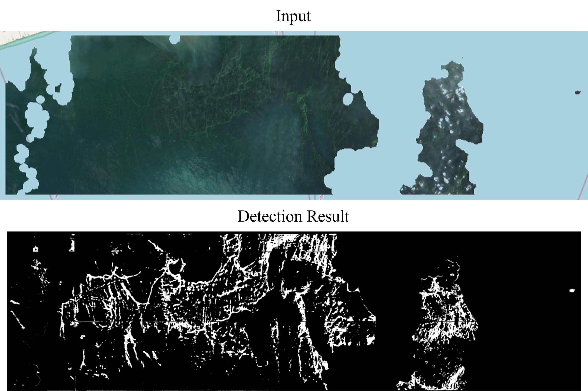
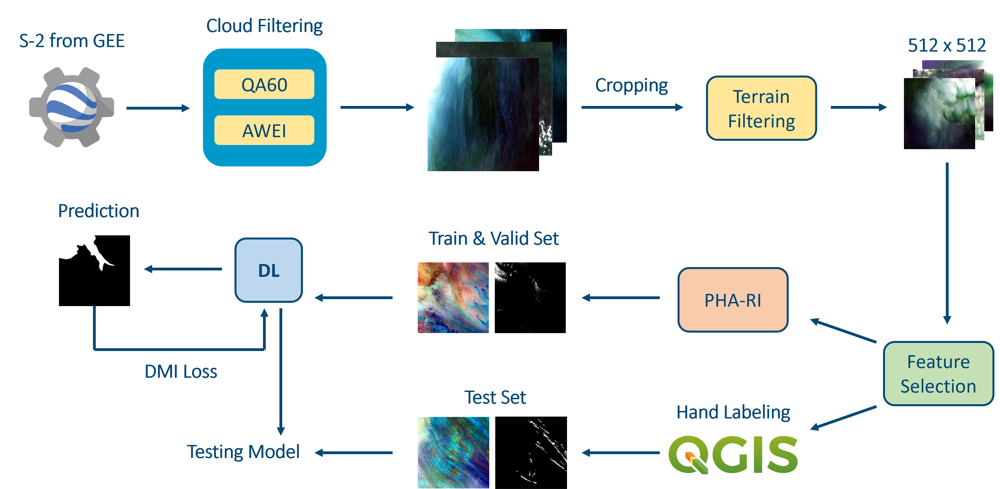
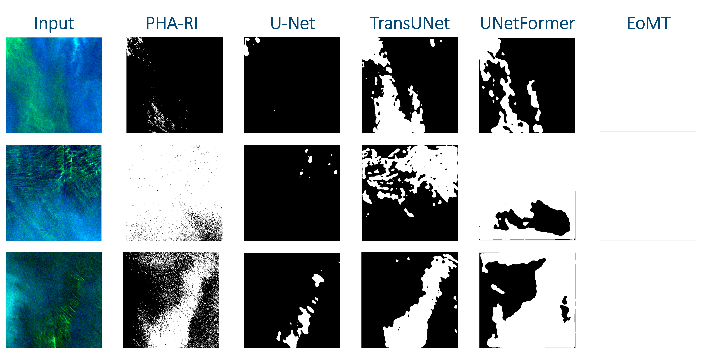

# Red Tide Detection in the Bay of Bangkok using Deep Learning and Sentinel-2 Imagery

*Red tide bloom detected in the Bay of Bangkok via Sentinel-2 satellite imagery*

---

## Overview

The Bay of Bangkok surrounds many of Thailand's most important fishery and tourism zones, including **Samut Sakhon (สมุทรสาคร)** and **Pattaya (พัทยา)**. Red tide events cause serious environmental damage along coastlines — producing foul odors, killing marine life, and devastating the tourism and fishing industries.

Early detection of red tide **before it reaches the shore** is therefore critical, giving authorities the time needed to prepare and respond effectively.

High-resolution satellite imagery from **[Sentinel-2](https://developers.google.com/earth-engine/datasets/catalog/COPERNICUS_S2_SR_HARMONIZED)** provides wide-area coverage that makes it possible to observe red tide phenomena at sea. While an existing detection method called **[PHA-RI](https://doi.org/10.1016/j.isprsjprs.2021.12.009)** can identify dense red tide patches from satellite imagery, its results tend to contain significant noise. Deep learning offers a promising path forward by extracting complex spectral and spatial features for more accurate detection.

---

## Objective

This study develops and compares multiple deep learning models for detecting red tide in the Bay of Bangkok using Sentinel-2 imagery, including:

- **[U-Net](https://arxiv.org/abs/1505.04597)**
- **[TransUNet](https://doi.org/10.1016/j.media.2024.103280)**
- **[UNetFormer](https://doi.org/10.1016/j.isprsjprs.2022.06.008)**
- **[EoMT](https://arxiv.org/abs/2503.19108)** (Encoder-only Mask Transformer)

---

## Workflow

*End-to-end pipeline from satellite data acquisition to model evaluation*

### 1. Data Acquisition
- Source: **Google Earth Engine**
- Dataset: Sentinel-2 Surface Reflectance (Level-2A)
- Coverage: Bay of Bangkok
- Time range: **March 28, 2017 – April 5, 2025**
- Cloud cover filter: ≤ 25%

### 2. Preprocessing
- Cloud masking using the **QA60 band**
- Land/water separation using the **[Automated Water Extraction Index (AWEI)](https://doi.org/10.1016/j.rse.2013.08.029)**
- Final output: **11-band images** per scene
- Images are tiled into **512 × 512 pixel** patches
- Only ocean-covered tiles are retained

### 3. Band Selection

After examining each individual band, **8 bands** were selected for their relevance to red tide identification:

| Band | Description |
|------|-------------|
| B2   | Blue |
| B3   | Green |
| B4   | Red |
| B5   | Red Edge 1 |
| B6   | Red Edge 2 |
| B7   | Red Edge 3 |
| B8A  | Red Edge 4 |
| B8   | Near Infrared (NIR) |

### 4. Dataset Splitting & Labeling

| Split | Labeling Method |
|-------|----------------|
| Train | PHA-RI (automated, parameter-tuned per image) |
| Validation | PHA-RI (automated, parameter-tuned per image) |
| Test | Manual annotation in **[QGIS](https://qgis.org/)** |

### 5. Normalization
Due to high variance across bands, **z-score normalization** is applied before feeding images into any model.

### 6. Noisy Label Learning
Because PHA-RI-generated labels are imperfect, models are trained using a **learning-with-noisy-labels** strategy. **[DMI Loss](https://arxiv.org/abs/1909.03388)** is used as the loss function to mitigate label noise during training.

---

## Models

| Model | Encoder | Decoder | Notes |
|-------|---------|---------|-------|
| **U-Net** | CNN | CNN | Classic semantic segmentation baseline |
| **TransUNet** | Transformer | CNN | Transformer-based encoder with CNN decoder |
| **UNetFormer** | CNN | Transformer | CNN encoder with Transformer-based decoder |
| **EoMT** | Vision Transformer | — | State-of-the-art ViT-based segmentation model |

---

## Results

*Visual comparison of red tide detection across methods — TransUNet clearly outperforms the baseline*

### Quantitative Comparison

| Method | Precision | Recall | F1-Score | IoU | Accuracy |
|--------|-----------|--------|----------|-----|----------|
| PHA-RI (baseline) | **82.35** | 25.98 | 25.35 | 17.63 | 88.07 |
| U-Net | 22.90 | 53.54 | 20.02 | 12.95 | 56.14 |
| TransUNet | 54.69 | 73.43 | **53.71** | **40.32** | **88.53** |
| UNetFormer | 54.05 | 59.03 | 44.08 | 31.73 | 83.40 |
| EoMT | 11.76 | **99.66** | 19.49 | 11.75 | 12.07 |

> **TransUNet achieved the best results across most evaluation metrics**, significantly outperforming both the traditional PHA-RI method and other deep learning models.

---

## Conclusion

This study successfully demonstrates accurate red tide detection in the Bay of Bangkok. The proposed system can identify red tide events **before they reach the shoreline**, enabling:

- Timely environmental impact mitigation
- Early warnings for relevant authorities
- Informed preparation and response planning

---

## Getting Started

### Pretrained Weights

Download pretrained model weights from Hugging Face:

🤗 [Boba-45/red-tide-model](https://huggingface.co/Boba-45/red-tide-model/tree/main)

### Running the Demo

Try the interactive demo on Google Colab (no setup required):

